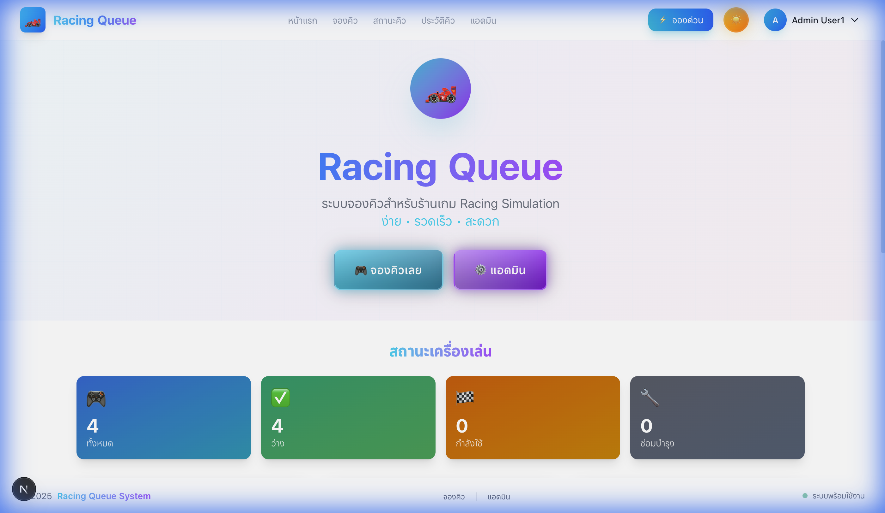
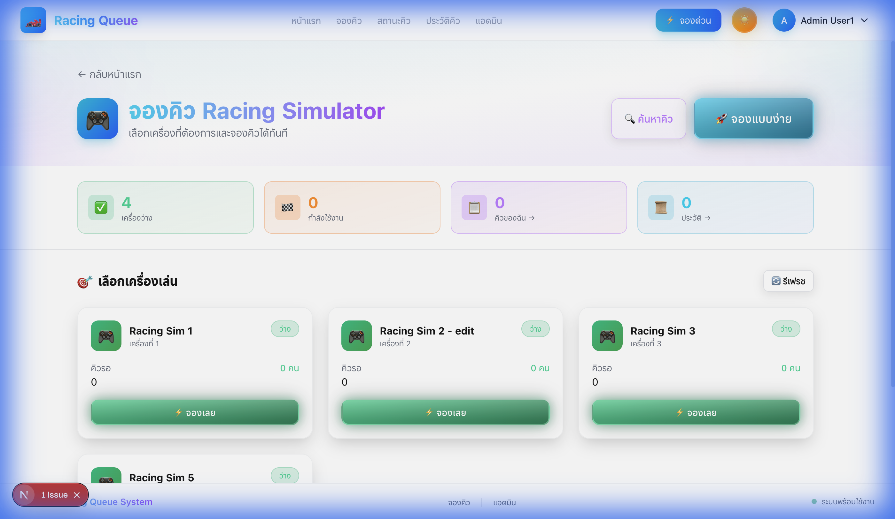
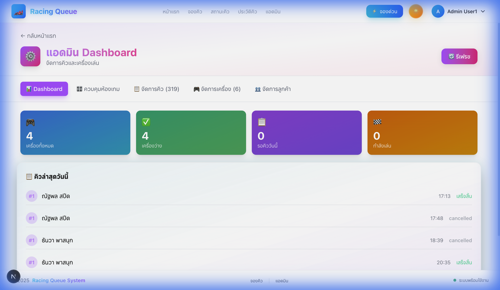
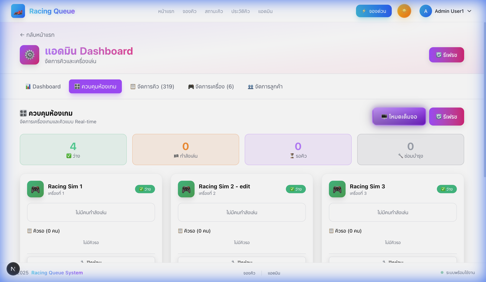

<p align="center">
  
</p>

<h1 align="center">🏎️ Racing Queue</h1>

<p align="center">
  <strong>ระบบจองคิว Racing Simulator ที่ทันสมัยและใช้งานง่าย</strong>
</p>

<p align="center">
  <a href="#"></a>
  <a href="#"></a>
  <a href="#"></a>
  <a href="#"></a>
</p>

<p align="center">
  <a href="#"></a>
  <a href="#"></a>
  <a href="#"></a>
</p>

---

## 📖 Overview

**Racing Queue** คือระบบจัดการคิวสำหรับร้านเกม Racing Simulation ที่ออกแบบมาให้ใช้งานง่าย รวดเร็ว และมีประสิทธิภาพ รองรับทั้งฝั่งลูกค้าและแอดมิน พร้อม Real-time updates

### ✨ Key Features

| Feature | Description |
|---------|-------------|
| 🎮 **Queue Management** | จองคิว ติดตามสถานะ ยกเลิกได้ทันที |
| 📊 **Admin Dashboard** | ควบคุมห้องเกมแบบ Real-time |
| 🌙 **Dark Mode** | รองรับโหมดมืด/สว่าง |
| 📱 **Responsive** | ใช้งานได้ทุกอุปกรณ์ |
| ⚡ **Quick Booking** | จองด่วนแบบ Focus Mode |
| 🔐 **Authentication** | ระบบ Login/Register ด้วย Supabase |
| 🔄 **Real-time** | อัพเดตสถานะแบบ Real-time |

---

## 🖥️ Screenshots

<div align="center">
  <table>
    <tr>
      <td align="center"><strong>🏠 Home Page</strong></td>
      <td align="center"><strong>🎮 Customer Booking</strong></td>
    </tr>
    <tr>
      <td></td>
      <td></td>
    </tr>
    <tr>
      <td align="center"><strong>⚙️ Admin Dashboard</strong></td>
      <td align="center"><strong>🎛️ Game Room Control</strong></td>
    </tr>
    <tr>
      <td></td>
      <td></td>
    </tr>
  </table>
</div>

---

## 🏗️ Architecture

โปรเจคนี้ใช้ **Clean Architecture** pattern เพื่อให้โค้ดมีความยืดหยุ่นและบำรุงรักษาง่าย:

```
┌─────────────────────────────────────────────────────────────┐
│                    PRESENTATION LAYER                        │
│         (Views, Components, Presenters, Stores)              │
│   ┌─────────────┐  ┌─────────────┐  ┌─────────────┐         │
│   │    Views    │  │  Presenters │  │   Stores    │         │
│   │  (React UI) │  │  (Business) │  │  (Zustand)  │         │
│   └─────────────┘  └─────────────┘  └─────────────┘         │
└───────────────────────────┬─────────────────────────────────┘
                            │
┌───────────────────────────▼─────────────────────────────────┐
│                    APPLICATION LAYER                         │
│              (Repository Interfaces, Use Cases)              │
│   ┌─────────────────────────────────────────────────────┐   │
│   │              IRepository Interfaces                  │   │
│   │  IMachineRepository  │  IQueueRepository  │ IAuth    │   │
│   └─────────────────────────────────────────────────────┘   │
└───────────────────────────┬─────────────────────────────────┘
                            │
┌───────────────────────────▼─────────────────────────────────┐
│                   INFRASTRUCTURE LAYER                       │
│           (Supabase, Mock Data, External APIs)               │
│   ┌─────────────────────┐  ┌─────────────────────┐          │
│   │  Supabase Repos     │  │    Mock Repos       │          │
│   │  (Production)       │  │   (Development)     │          │
│   └─────────────────────┘  └─────────────────────┘          │
└─────────────────────────────────────────────────────────────┘
```

### 📁 Project Structure

```
racing-simulation-queue-nextjs/
├── app/                          # Next.js App Router
│   ├── layout.tsx               # Root layout
│   ├── page.tsx                 # Home page
│   ├── auth/                    # Authentication pages
│   ├── backend/                 # Admin dashboard
│   ├── customer/                # Customer pages
│   └── quick-booking/           # Quick booking page
│
├── src/
│   ├── application/             # Application layer
│   │   └── repositories/        # Repository interfaces
│   │
│   ├── domain/                  # Domain layer
│   │   └── types/               # TypeScript types & Supabase types
│   │
│   ├── infrastructure/          # Infrastructure layer
│   │   ├── repositories/        # Repository implementations
│   │   │   ├── mock/            # Mock data for development
│   │   │   └── supabase/        # Supabase implementations
│   │   └── supabase/            # Supabase client
│   │
│   ├── presentation/            # Presentation layer
│   │   ├── components/          # React components
│   │   ├── presenters/          # Business logic presenters
│   │   ├── providers/           # Context providers
│   │   └── stores/              # Zustand stores
│   │
│   └── config/                  # Configuration files
│
├── supabase/                    # Supabase configuration
│   ├── config.toml              # Local Supabase config
│   ├── migrations/              # Database migrations
│   └── seeds/                   # Seed data
│
├── scripts/                     # Deployment scripts
│   ├── deploy-vercel.sh         # Vercel deployment
│   ├── deploy-supabase.sh       # Supabase deployment
│   └── setup-env.sh             # Environment setup
│
└── public/                      # Static assets
```

---

## 🚀 Quick Start

### Prerequisites

- **Node.js** 18.x or later
- **npm** 9.x or later (or yarn/pnpm)
- **Supabase CLI** (for local development)
- **Vercel CLI** (for deployment)

### Installation

```bash
# 1. Clone the repository
git clone https://github.com/yourusername/racing-simulation-queue-nextjs.git
cd racing-simulation-queue-nextjs

# 2. Install dependencies
npm install

# 3. Copy environment file
cp .env.example .env.local

# 4. Start local Supabase (optional, for local development)
npm run supabase-start

# 5. Run development server
npm run dev
```

Visit [http://localhost:3000](http://localhost:3000) to see the app.

---

## 📝 Available Scripts

| Script | Description |
|--------|-------------|
| `npm run dev` | Start development server with Turbopack |
| `npm run build` | Build for production |
| `npm run start` | Start production server |
| `npm run type-check` | Run TypeScript type checking |
| `npm run lint` | Run ESLint |
| `npm run supabase-start` | Start local Supabase instance |
| `npm run supabase-stop` | Stop local Supabase instance |
| `npm run supabase-reset` | Reset local database with migrations |
| `npm run supabase-migrate` | Run database migrations |
| `npm run supabase-generate` | Generate TypeScript types from Supabase |
| `npm run deploy:vercel` | Deploy to Vercel (production) |
| `npm run deploy:supabase` | Deploy database migrations to Supabase |
| `npm run deploy:all` | Deploy both Vercel and Supabase |
| `npm run setup:env` | Setup environment variables |

---

## 🌐 Deployment

### Environment Variables

Create a `.env.local` file with the following variables:

```bash
# Supabase Configuration (Required)
NEXT_PUBLIC_SUPABASE_URL=https://your-project.supabase.co
NEXT_PUBLIC_SUPABASE_ANON_KEY=your-anon-key
SUPABASE_SERVICE_ROLE_KEY=your-service-role-key

# Application Configuration
NEXT_PUBLIC_APP_URL=https://your-app.vercel.app
NEXT_PUBLIC_APP_NAME="Racing Simulation Queue"

# Auth Configuration
NEXT_PUBLIC_AUTH_EMAIL_ENABLED=true
NEXT_PUBLIC_AUTH_REGISTRATION_ENABLED=false
NEXT_PUBLIC_AUTH_FORGOT_PASSWORD_ENABLED=true
```

### Deploy to Vercel

```bash
# Using the deployment script
npm run deploy:vercel

# Or manually
vercel --prod
```

### Deploy to Supabase

```bash
# Using the deployment script
npm run deploy:supabase

# Or manually
supabase db push
```

### Full Deployment

```bash
# Deploy everything at once
npm run deploy:all
```

---

## 🎯 Routes

| Route | Description | Access |
|-------|-------------|--------|
| `/` | Home page with machine overview | Public |
| `/customer` | Customer booking page | Public |
| `/customer/queue/[id]` | Queue status page | Public |
| `/customer/queue-status` | Queue status lookup | Public |
| `/customer/queue-history` | Booking history | Public |
| `/quick-booking` | Quick booking (Focus Mode) | Public |
| `/backend` | Admin dashboard | Protected |
| `/profile` | User profile | Protected |
| `/auth/login` | Login page | Public |
| `/auth/register` | Register page | Public |
| `/auth/forgot-password` | Forgot password | Public |

---

## 🛠️ Tech Stack

| Category | Technology |
|----------|------------|
| **Framework** | Next.js 16.1 (App Router) |
| **Language** | TypeScript 5.x |
| **Styling** | TailwindCSS 4.0 |
| **State Management** | Zustand 5.x |
| **Database** | Supabase (PostgreSQL) |
| **Authentication** | Supabase Auth |
| **Animations** | react-spring |
| **Forms** | react-hook-form + Zod |
| **Theming** | next-themes |
| **3D Graphics** | Three.js + React Three Fiber |

---

## 📦 Data Models

### Machine

```typescript
interface Machine {
  id: string;
  name: string;
  description: string;
  position: number;
  status: 'available' | 'occupied' | 'maintenance';
  isActive: boolean;
  imageUrl?: string;
  createdAt: string;
  updatedAt: string;
}
```

### Queue

```typescript
interface Queue {
  id: string;
  machineId: string;
  customerId?: string;
  customerName: string;
  customerPhone: string;
  bookingTime: string;
  duration: number;
  status: 'waiting' | 'playing' | 'completed' | 'cancelled';
  position: number;
  createdAt: string;
  updatedAt: string;
}
```

---

## 🧪 Testing

```bash
# Run TypeScript type checking
npm run type-check

# Run ESLint
npm run lint

# Build for production (includes all checks)
npm run build
```

---

## 🔒 Security

- **Row Level Security (RLS)** enabled on all Supabase tables
- **Protected routes** using Next.js middleware
- **JWT authentication** via Supabase Auth
- **Environment variables** for sensitive data

---

## 🤝 Contributing

1. Fork the repository
2. Create your feature branch (`git checkout -b feature/amazing-feature`)
3. Commit your changes (`git commit -m 'Add some amazing feature'`)
4. Push to the branch (`git push origin feature/amazing-feature`)
5. Open a Pull Request

---

## 📄 License

This project is licensed under the MIT License - see the [LICENSE](LICENSE) file for details.

---

## 👥 Team

<table>
  <tr>
    <td align="center">
      <strong>Racing Queue Team</strong><br />
      <sub>Built with ❤️ in Thailand</sub>
    </td>
  </tr>
</table>

---

<p align="center">
  <strong>🏎️ Racing Queue - จองคิว ง่าย รวดเร็ว ทันใจ</strong>
</p>
