# แก้ปัญหา Booking Slot ไม่คำนวณ Active Sessions

## 🔍 ปัญหาที่พบ

ระบบปัจจุบันมีช่องโหว่ในการคำนวณ slot availability:

### สถานการณ์ที่เกิดปัญหา
1. **ผู้เล่นแบบ Walk-in Queue** - เมื่อ staff กด `rpc_start_session` จาก queue จะสร้าง session ที่ไม่มี `end_time` (เล่นจนกว่าจะจบ)
2. **ผู้เล่นแบบ Manual** - staff สร้าง session โดยตรงโดยไม่ผ่าน booking หรือ queue

### ปัญหา
- Function `rpc_is_booking_slot_available` **ตรวจสอบเฉพาะตาราง `bookings`** เท่านั้น
- ไม่ได้ตรวจสอบ **active sessions** (sessions ที่ `end_time IS NULL`)
- ทำให้ลูกค้าเห็นว่า "slot ว่าง" แต่จริงๆ เครื่องถูกใช้งานอยู่

```mermaid
flowchart TD
    A[Customer ต้องการจอง] --> B{rpc_is_booking_slot_available}
    B --> C[ตรวจ bookings table]
    C --> D{พบ conflict?}
    D -->|ไม่พบ| E[✅ Available]
    D -->|พบ| F[❌ Not Available]
    
    G[Walk-in/Manual Session กำลังเล่นอยู่]
    G -.-> H[sessions table - end_time IS NULL]
    H -.->|ไม่ถูกตรวจสอบ!| E
    
    style G fill:#ff6b6b
    style H fill:#ff6b6b
    style E fill:#51cf66
```



## 📋 ข้อมูล Table Relations

### Sessions Table
```sql
sessions (
    id UUID,
    station_id UUID,        -- เครื่องที่เล่นอยู่
    booking_id UUID,        -- NULL ถ้าไม่ได้มาจาก booking
    queue_id UUID,          -- NULL ถ้าไม่ได้มาจาก walk-in queue
    customer_name TEXT,
    start_time TIMESTAMPTZ, -- เวลาเริ่มเล่น
    end_time TIMESTAMPTZ,   -- NULL = กำลังเล่นอยู่
    ...
)
```

### Active Session หมายถึง
- `end_time IS NULL` = เครื่องกำลังถูกใช้งานอยู่

---

## User Review Required

> [!IMPORTANT]
> **ต้องตัดสินใจ**: เมื่อมี active session อยู่ จะทำอย่างไรกับการจอง?
>
> **Option A**: Block ทุกช่วงเวลาในวันนี้สำหรับเครื่องที่มี active session
> **Option B**: Block เฉพาะช่วงเวลาปัจจุบัน + N นาที (เช่น + 60 นาที buffer)
> **Option C**: ให้ staff กำหนด estimated_end_time เมื่อ start session สำหรับ walk-in/manual

---

## Proposed Changes

### Database - Sessions Table

#### [MODIFY] [20260119000002_sessions.sql](file:///Users/marosdeeuma/racing-simulation-queue-nextjs/supabase/migrations/20260119000002_sessions.sql)

เพิ่ม column `estimated_end_time` ใน sessions table:

```sql
-- Add estimated_end_time for walk-in/manual sessions
ALTER TABLE public.sessions 
ADD COLUMN IF NOT EXISTS estimated_end_time TIMESTAMPTZ;

COMMENT ON COLUMN public.sessions.estimated_end_time 
IS 'Estimated end time for walk-in/manual sessions. Used for slot availability calculation.';
```

---

### Database - Slot Availability Function

#### [MODIFY] [20260115000000_bookings.sql](file:///Users/marosdeeuma/racing-simulation-queue-nextjs/supabase/migrations/20260115000000_bookings.sql)

แก้ไข `rpc_is_booking_slot_available` ให้ตรวจสอบ active sessions ด้วย:

```sql
CREATE OR REPLACE FUNCTION public.rpc_is_booking_slot_available(
    p_machine_id UUID,
    p_local_date DATE,
    p_local_start_time TIME,
    p_duration_minutes INTEGER,
    p_timezone TEXT DEFAULT 'Asia/Bangkok'
)
RETURNS BOOLEAN
LANGUAGE plpgsql
SECURITY DEFINER
AS $$
DECLARE
    v_start_at TIMESTAMPTZ;
    v_end_at TIMESTAMPTZ;
    v_booking_conflict INTEGER;
    v_session_conflict INTEGER;
BEGIN
    -- Convert local date+time to TIMESTAMPTZ
    v_start_at := (p_local_date || ' ' || p_local_start_time)::TIMESTAMP AT TIME ZONE p_timezone;
    v_end_at := v_start_at + (p_duration_minutes || ' minutes')::INTERVAL;
    
    -- 1. Check booking conflicts (existing logic)
    SELECT COUNT(*) INTO v_booking_conflict
    FROM public.bookings
    WHERE machine_id = p_machine_id
      AND status IN ('pending', 'confirmed', 'checked_in', 'seated')
      AND start_at < v_end_at 
      AND end_at > v_start_at;
    
    IF v_booking_conflict > 0 THEN
        RETURN false;
    END IF;
    
    -- 2. Check active session conflicts (NEW)
    -- Active sessions have end_time IS NULL
    -- Use estimated_end_time if available, otherwise use NOW() + buffer
    SELECT COUNT(*) INTO v_session_conflict
    FROM public.sessions
    WHERE station_id = p_machine_id
      AND end_time IS NULL  -- Active session
      AND start_time < v_end_at
      AND COALESCE(estimated_end_time, NOW() + INTERVAL '2 hours') > v_start_at;
    
    IF v_session_conflict > 0 THEN
        RETURN false;
    END IF;
    
    RETURN true;
END;
$$;
```

---

### Database - Start Session Function

#### [MODIFY] [20260119000002_sessions.sql](file:///Users/marosdeeuma/racing-simulation-queue-nextjs/supabase/migrations/20260119000002_sessions.sql)

แก้ไข `rpc_start_session` ให้รับ `p_estimated_duration_minutes`:

```sql
CREATE OR REPLACE FUNCTION public.rpc_start_session(
    p_station_id UUID,
    p_customer_name TEXT,
    p_booking_id UUID DEFAULT NULL,
    p_queue_id UUID DEFAULT NULL,
    p_notes TEXT DEFAULT NULL,
    p_estimated_duration_minutes INTEGER DEFAULT 60  -- NEW parameter
)
RETURNS JSON
...
    -- Insert with estimated_end_time
    INSERT INTO public.sessions (
        station_id,
        customer_name,
        booking_id,
        queue_id,
        notes,
        start_time,
        estimated_end_time  -- NEW
    ) VALUES (
        p_station_id,
        TRIM(p_customer_name),
        p_booking_id,
        p_queue_id,
        p_notes,
        NOW(),
        CASE 
            WHEN p_booking_id IS NOT NULL THEN NULL  -- Booking has its own end_at
            ELSE NOW() + (p_estimated_duration_minutes || ' minutes')::INTERVAL
        END
    )
...
```

---

### Frontend - Backend Presenter

#### [MODIFY] [BackendPresenter.ts](file:///Users/marosdeeuma/racing-simulation-queue-nextjs/src/presentation/presenters/backend/BackendPresenter.ts)

เพิ่ม parameter `estimatedDurationMinutes` เมื่อ start session:

```typescript
async startSession(
  stationId: string,
  customerName: string,
  bookingId?: string,
  queueId?: string,
  notes?: string,
  estimatedDurationMinutes?: number  // NEW
): Promise<Session> {
  // ...
}
```

---

### Frontend - UI Update

#### [MODIFY] Staff UI
เพิ่ม input ให้ staff ระบุ estimated duration เมื่อ start session แบบ walk-in หรือ manual

---

## Verification Plan

### Automated Tests
1. สร้าง active session บนเครื่อง A
2. เรียก `rpc_is_booking_slot_available` สำหรับเครื่อง A ในช่วงเวลาปัจจุบัน
3. ตรวจสอบว่า return `false`

### Manual Verification
1. Staff start session แบบ walk-in บนเครื่อง A
2. ลูกค้าพยายามจองเครื่อง A ในเวลาใกล้เคียง
3. ระบบต้องแสดงว่า slot ไม่ว่าง

---

## สรุป Flow ใหม่

```mermaid
flowchart TD
    A[Customer ต้องการจอง] --> B{rpc_is_booking_slot_available}
    B --> C[ตรวจ bookings table]
    C --> D{พบ booking conflict?}
    D -->|พบ| F[❌ Not Available]
    D -->|ไม่พบ| E[ตรวจ active sessions]
    E --> G{พบ session conflict?}
    G -->|พบ| F
    G -->|ไม่พบ| H[✅ Available]
    
    style F fill:#ff6b6b
    style H fill:#51cf66
```


