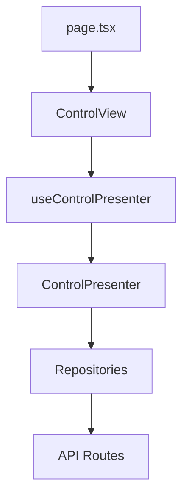

# Game Room Control Page - Walkthrough

## Summary
สร้างหน้า **Full-Screen Control Panel** ใหม่ที่ `/backend/control` สำหรับควบคุมห้องเกม โดยใช้ **Session-Centric Architecture** ตาม pattern ที่กำหนด

---

## Files Created

| File | Purpose |
|------|---------|
| [page.tsx](file:///Users/marosdeeuma/racing-simulation-queue-nextjs/app/backend/control/page.tsx) | Page route |
| [ControlPresenter.ts](file:///Users/marosdeeuma/racing-simulation-queue-nextjs/src/presentation/presenters/backend/ControlPresenter.ts) | Business logic & ViewModel |
| [ControlPresenterClientFactory.ts](file:///Users/marosdeeuma/racing-simulation-queue-nextjs/src/presentation/presenters/backend/ControlPresenterClientFactory.ts) | Factory for client-side |
| [useControlPresenter.ts](file:///Users/marosdeeuma/racing-simulation-queue-nextjs/src/presentation/presenters/backend/useControlPresenter.ts) | React hook for state |
| [ControlView.tsx](file:///Users/marosdeeuma/racing-simulation-queue-nextjs/src/presentation/components/backend/ControlView.tsx) | Main UI component |

---

## Architecture

---

## Features

### Station States
| State | Color | Actions |
|-------|-------|---------|
| 🟢 Available | Green | Start Manual, From Queue |
| 🔴 In Use | Orange | End Session |
| 🟡 Reserved | Yellow | Check-in |

### Key Actions
1. **Start Manual** - เริ่มเล่นแบบ walk-in
2. **From Queue** - เลือกจากคิวที่รอ
3. **Check-in** - สำหรับ booking ที่จอง
4. **End Session** - จบการเล่น

---

## Validation

✅ TypeScript build passes (`tsc --noEmit`)

---

## Access

Navigate to: [http://localhost:3000/backend/control](http://localhost:3000/backend/control)
